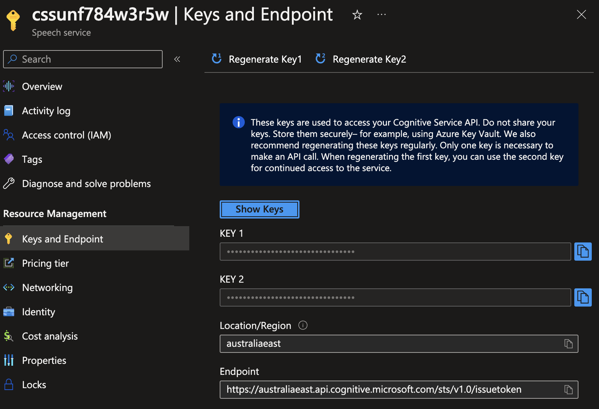
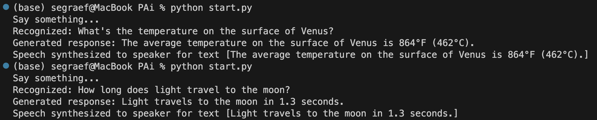

# Build your own GPT-Powered AI Voice Assistant with Azure OpenAI and Cognitive Services


Let's build your own AI voice assistant which is better than Amazon's **Alexa** using Azure Cognitive Services (SST and TTS) and OpenAI.

<!--more-->
> A working version, written under 60 lines of code can be found [here](https://github.com/segraef/PAi/blob/main/start.py).

By combining the speech recognition and synthesis capabilities of Azure with the power of OpenAI's GPT model, we can create an intelligent and conversational voice assistant. This tutorial will provide step-by-step instructions and code examples to help you get started.

## Prerequisites
Before getting started make sure you have the following prerequisites installed on your system:

- Python 3.10.8
- Azure Cognitive Services Speech SDK
- Microphone (input) and speaker (output)

```shell
# Azure Cognitive Services Speech SDK
pip install azure-cognitiveservices-speech

# OpenAI Python Library
pip install openai
```

## Workflow

Let me give you the bigger picture upfront for a better understanding:


stateDiagram
    [*] --> SpeechToText
    SpeechToText --> AzureOpenAI
    AzureOpenAI --> TextToSpeech
    TextToSpeech --> [*]


## Setting up Azure Cognitive Services
First, obtain your Azure Cognitive Services subscription key and region.



Then, using the Azure Cognitive Services Speech SDK, you can configure the `SpeechConfig` object with your subscription key and region. For example:

```shell
# Save as environment variable
export cognitive_services_speech_key=<YOUR_API_KEY>
```

```python
import azure.cognitiveservices.speech as speechsdk

speech_key = os.environ.get('cognitive_services_speech_key')
service_region = "australiaeast"

speech_config = speechsdk.SpeechConfig(subscription=speech_key, region=service_region)
speech_config.speech_synthesis_voice_name = "en-US-AshleyNeural"
```

This configuration allows you to access Azure's speech recognition and synthesis capabilities.
All voices can be found [here](https://learn.microsoft.com/en-us/azure/cognitive-services/speech-service/language-support?tabs=tts).

## Integrating Azure OpenAI
In addition to Azure Cognitive Services, we will integrate OpenAI's GPT model to generate intelligent responses. First, ensure you have an OpenAI API key.



Then, using the OpenAI Python library, you can configure the API with your key. For example:

```shell
# Save as environment variable
export openai_api_key=<YOUR_API_KEY>
export openai_api_base=https://<YOUR_OPENAI_SERVICE>.openai.azure.com
```

```python
import openai

openai.api_key = os.environ.get('openai_api_key')
openai.api_base = os.environ.get('openai_api_base')
```

With this integration, we can leverage the power of GPT to generate contextually relevant responses based on user input.

## Recognizing and Generating Speech
The core functionality of our voice assistant involves recognizing user speech and generating appropriate responses. Azure Cognitive Services provides the SpeechRecognizer class for speech recognition. Here's an example of recognizing speech from an audio input stream:

```python
# Process the recognized text
speech_recognizer = speechsdk.SpeechRecognizer(speech_config=speech_config)
result = speech_recognizer.recognize_once()
if result.reason == speechsdk.ResultReason.RecognizedSpeech:
    recognized_text = result.text
```

Once the user's speech is recognized, we can use OpenAI's GPT model to generate a response. Here's an example of generating a response using OpenAI:

```python
# Process the generated response
response = openai.Completion.create(
    engine="davinci",
    prompt=recognized_text,
    max_tokens=100
)
generated_response = response.choices[0].text.strip()
```

## Synthesizing Speech Output
To provide a natural voice output, Azure Cognitive Services offers the `SpeechSynthesizer` class for speech synthesis. You can synthesize the generated response into speech using the SpeechSynthesizer's `speak_text_async` method. Here's an example:

```python
# Play or save the synthesized speech
speech_synthesizer = speechsdk.SpeechSynthesizer(speech_config=speech_config)
result = speech_synthesizer.speak_text_async(generated_response).get()
if result.reason == speechsdk.ResultReason.SynthesizingAudioCompleted:
```

## Example and Code



[Here](https://github.com/segraef/PAi) is a working version written in Python.

## Next steps
We covered the process of building a GPT-powered AI voice assistant using Azure Cognitive Services and OpenAI. The next step is to port this onto a Raspberry Pi which we equip with a speaker and microphone. More details in the next post.



- [github.com/PAi](https://github.com/segraef/PAi)


