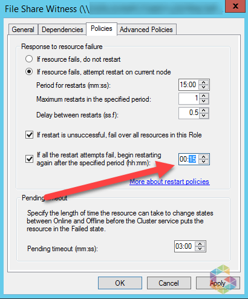

The purpose of this article is to show how to adjust Windows Failover Cluster “Response to resource failure” policy.

If a Cluster Core Resource like File Share Witness or Disk Quorum is in a failing state and offline, the cluster runs into jeopardy and will fail once the active node gets rebooted as no vote can be set to the quorum. To avoid this you should decrease the value of time your cluster core resource attempts to restart. The lower the value the higher the amount of retries your resource has to restart itself.
To increase restart attempts for the Cluster Core Resource you need to adjust the “Response to resource failure” policy from one hour to 15 minutes.

So with a given period for restarts of 15 minutes, maximum restarts in the specified period of 1 and “If all the restart attempts fail, begin restarting again after the specified period of period” of 15 minutes. The resource will try restarting itself again every 15 minutes instead every hour until it’s brought back up online.