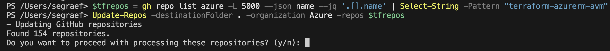

Working in large enterprise environments often means managing a complex landscape of repositories across multiple GitHub organizations and Azure DevOps projects. Keeping these repositories up to date—especially when working with multiple engineering teams—can be a daunting task. That’s where automation comes in.

To simplify this, I’ve developed a consolidated PowerShell script that combines the functionality of my previous scripts into one:

- [Update-Repos.ps1](https://github.com/segraef/Scripts/blob/main/PowerShell/Update-Repos.ps1)

This script helps automate the process of cloning and updating repositories, making it significantly easier to manage a large number of repos efficiently.

<!--more-->

## A Small Part of a Larger PowerShell Toolkit

This script is just a tiny piece of a broader collection of PowerShell snippets and scripts that I develop, use, and refine during my global engagements. I maintain a whole [Scripts repository](https://github.com/segraef/Scripts/blob/main/PowerShell/) where I collect and publish various automation tools that help streamline workflows in enterprise environments. Feel free to explore and use them!

## A Unified Solution for GitHub & Azure DevOps

The **Update-Repos.ps1** script is designed to streamline repository management by:

- Retrieving a list of repositories from GitHub organizations and Azure DevOps projects
- Cloning repositories if they don’t already exist locally
- Updating repositories that are already cloned
- Ensuring local repositories stay in sync with remote changes

### Why This is Essential
When working with multiple repositories across teams, keeping everything updated manually is tedious and error-prone. This script allows you to automate the process, ensuring that all your repositories are always up to date, regardless of whether they are hosted on GitHub or Azure DevOps.

### Key Features
- Supports both GitHub and Azure DevOps repositories
- Retrieves repository lists dynamically
- Clones repositories if they don’t exist
- Updates existing repositories to stay in sync with remote changes
- Reduces manual effort, allowing teams to focus on development

### Example Usage:
```powershell
# Get all Azure Verified Modules Terraform Repos
$tfrepos = gh repo list azure -L 5000 --json name --jq '.[].name' | Select-String -Pattern "terraform-azurerm-avm"

# Update all GitHub Repos
Update-Repos -destinationFolder . -organization Azure -repos $tfrepos
```



```powershell
# Azure DevOps
Update-Repos -destinationFolder . -organization "<ADO_ORG>" -pat "<PAT>"
```

This ensures that all repositories from the specified GitHub organization or Azure DevOps project are cloned or updated in the designated directory.

---

## Why This Script Matters in Enterprise Development

Managing multiple repositories is a challenge in enterprise settings, particularly when working across teams and organizations. **Update-Repos.ps1** simplifies this process by:

- Saving time by automating repo management tasks
- Reducing errors associated with manual updates
- Improving efficiency in complex multi-repo environments
- Enhancing collaboration across distributed teams

This script has been an invaluable tool in my daily work, and I highly recommend integrating it into your workflow if you manage repositories across GitHub and Azure DevOps.

You can check out the script here:
- [Update-Repos.ps1](https://github.com/segraef/Scripts/blob/main/PowerShell/Update-Repos.ps1)

If you have any questions or suggestions, feel free to reach out!

---


- [segraef/Scripts](https://github.com/segraef/Scripts/blob/main/PowerShell/)

