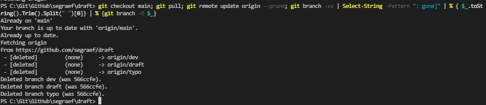
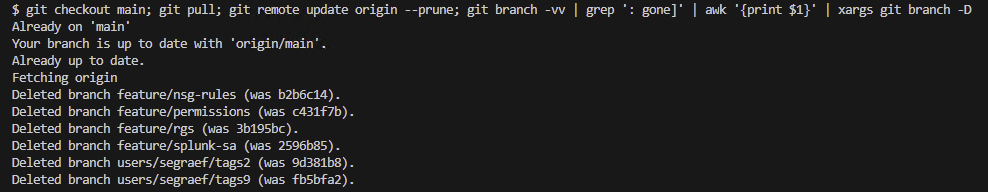

Use this nice PowerShell and Bash one-liner to automatically clean up (delete) your local branch once your remote branch is deleted (merged).

<!--more-->

## One-liner (PowerShell)

```pwsh
git checkout main; git pull; git remote update origin --prune; git branch -vv | Select-String -Pattern ": gone]" | % { $_.toString().Trim().Split(" ")[0]} | % { git branch -D $_ }
```

That's how it looks like:



## Step by step (PowerShell)

```pwsh
git checkout main
git pull
git remote update origin --prune
git branch -vv | Select-String -Pattern ": gone]" | % { $_.toString().Trim().Split(" ")[0]} | % { git branch -D $_ }
```

## One-liner (bash)

```bash
git checkout main && git pull && git remote update origin --prune && git branch -vv | grep ": gone]" | awk "{print \$1}" | xargs git branch -D
```

That's how it looks like:



## Step by step (bash)

```bash
git checkout main
git pull
git remote update origin --prune
git branch -vv | grep ': gone]' | awk '{print $1}' | xargs git branch -D
```

# Update:

Added this little PowerShell snippet with which you can clean up **all** your local branches that are already merged into main. Faster than doing it manually one by one.

```pwsh
Param(
   [string]$destinationFolder = "."
)

$repos = Get-ChildItem -Path $destinationFolder -Directory

foreach ($repo in $repos) {
  $($repo.FullName)
  Set-Location "$($repo.FullName)"
  git checkout main
  git pull
  git remote update origin --prune
  git branch -vv | Select-String -Pattern ": gone]" | % { $_.toString().Trim().Split(" ")[0]} | % { git branch -D $_ }
}

```



- [git-fetch](https://git-scm.com/docs/git-fetch)
- [git prune](https://git-scm.com/docs/git-prune)
- [git checkout](https://git-scm.com/docs/git-checkout)
  
