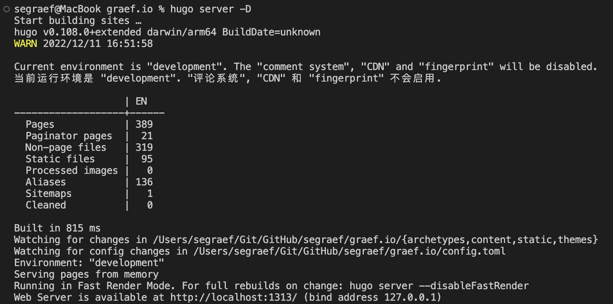

You can use GitHub Pages to host a website about yourself, your organization, or your project directly from a repository on GitHub.com. Hugo takes `Markdown`, runs them through a theme template, and spits out HTML files that you can easily deploy online – extremely fast.

<!--more-->

# Why GitHub Pages?

GitHub Pages is a static site hosting service that takes HTML, CSS, and JavaScript files straight from a repository on GitHub, optionally runs the files through a build process, and publishes a website. You can see examples of GitHub Pages sites in the [GitHub Pages examples collection](https://github.com/collections/github-pages-examples).

You can host your site on GitHub's `github.io` domain or your own custom domain. For more information, see [Using a custom domain with GitHub Pages](https://docs.github.com/en/articles/using-a-custom-domain-with-github-pages).

# Why Hugo and not Gatsby or Jekyll?

A static site generator like Hugo takes `Markdown` content files, runs them through a theme template, and spits out HTML files that you can easily deploy online – and it does all of this extremely fast.

Primarily because of speed, performance, simplicity, easy setup and most importantly the templates look generally better.
More details see [Gatsby vs. Jekyll vs. Hugo](https://www.gatsbyjs.com/features/jamstack/gatsby-vs-jekyll-vs-hugo)

# Quick Start
Hugo [Quick Start](https://gohugo.io/getting-started/quick-start/)

## Windows

`choco install hugo-extended -confirm`

## Linux and macOS

`brew install hugo`

## Commands

Following are the most importang `hugo` commands you need, of course there are more but you don't need them for now, otherwise just type `hugo help`.

`hugo config` – displays the configuration for a Hugo site
`hugo new` – lets you create new content for your site
`hugo server` – starts a local development server
`hugo version` – displays the current Hugo version

# Hugo Configuration File

Let's have a look at the first rows of the [`config.toml`](https://github.com/segraef/graef.io/blob/draft/config.toml) on my page which is a bit bigger than usual since it uses settings in regards to the theme I'm using but if yiou read through it just makes sense.

Here the first few lines which give you an idea:
```
baseURL = "https://graef.io/"
defaultContentLanguage = "en"
languageCode = "en"
title = "Automate everything "
enableRobotsTXT = true
theme = "loveit"
```

# Hugo Templates

You can find plenty of awesome templates here [Hugo Templates](https://gohugo.io/templates/).
The template used for this page is called LoveIt and can be found [here](https://github.com/dillonzq/LoveIt).

Another greate starter theme I can recommend is [Coder](https://github.com/luizdepra/hugo-coder).


# How to add a Theme to your Hugo Site
Once you've choosen a theme and cloned (or submoduled) it into your `/themes/` directory make sure to set it in your config.toml

`theme = "<theme_name>"`

# Test and preview your Hugo Site

`hugo server -D`

Hugo will then build your site’s pages and make them available at [`http://localhost:1313/`](http://localhost:1313/).



# How to add Posts to your Hugo Site

`hugo new posts/2021/2022-11-12-sample-post.md`

which creates an empty `markdown` file with metadata like this

```
---

title: "2022 12 12 Sample Post"

date: 2022-11-12T12:24:28+06:00

draft: true

---
```

# Create a GitHub Pages Site

After you're done with creating your site locally you can upload it to GitHub Pages. More details see [Creating a GitHub Pages Site](index.en.mdhttps://docs.github.com/en/pages/getting-started-with-github-pages/creating-a-github-pages-site).

# Continous Deployment of GitHub Pages with GitHub Actions

Details see my blog post [Continously Deploy Your Github Pages Site With Github Actions](../continously-deploy-your-github-pages-site-with-github-actions/).


- [Creating a GitHub Pages site](https://docs.github.com/en/pages/getting-started-with-github-pages/creating-a-github-pages-site)
- [Gatsby vs. Jekyll vs. Hugo](https://www.gatsbyjs.com/features/jamstack/gatsby-vs-jekyll-vs-hugo)
- [Hugo Templates](https://gohugo.io/templates/)
- [LoveIt Theme](https://github.com/dillonzq/LoveIt)
- [Coder Theme](https://github.com/luizdepra/hugo-coder)
- [Creating a GitHub Pages Site](index.en.mdhttps://docs.github.com/en/pages/getting-started-with-github-pages/creating-a-github-pages-site)


