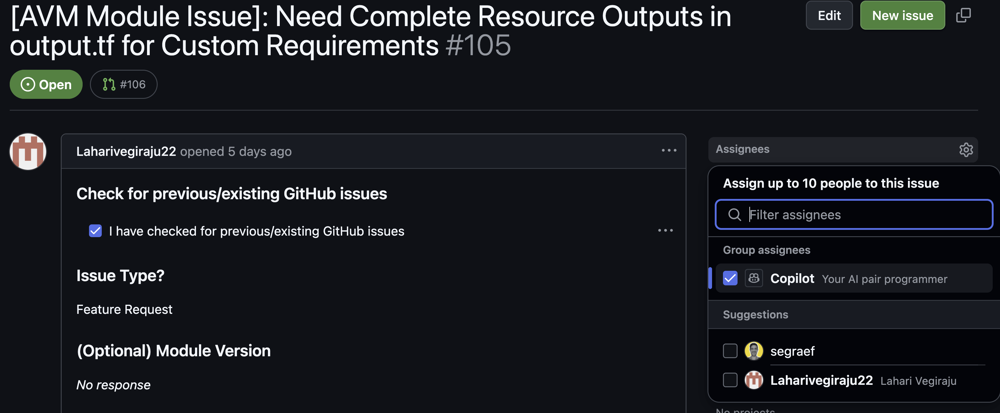
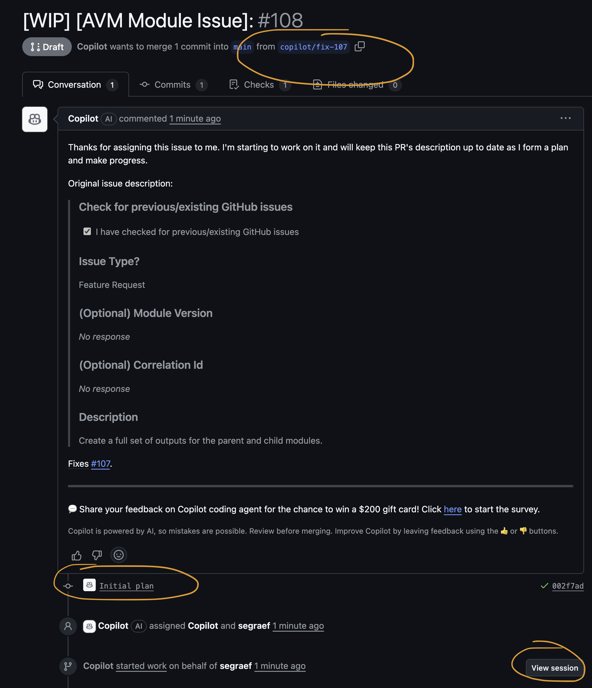
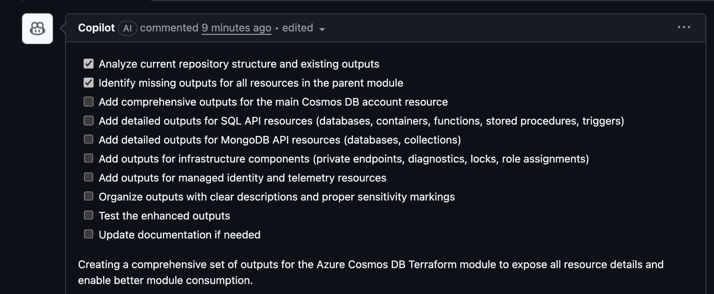
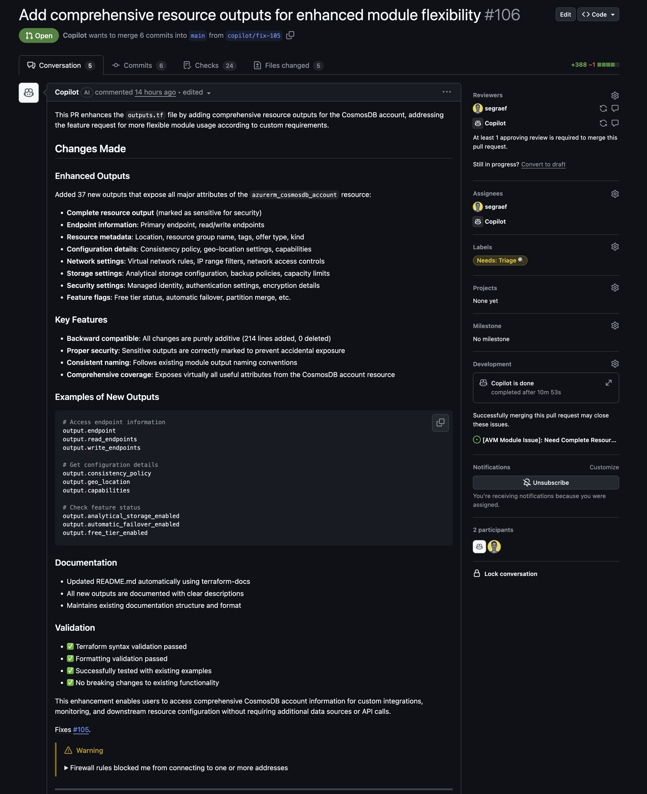
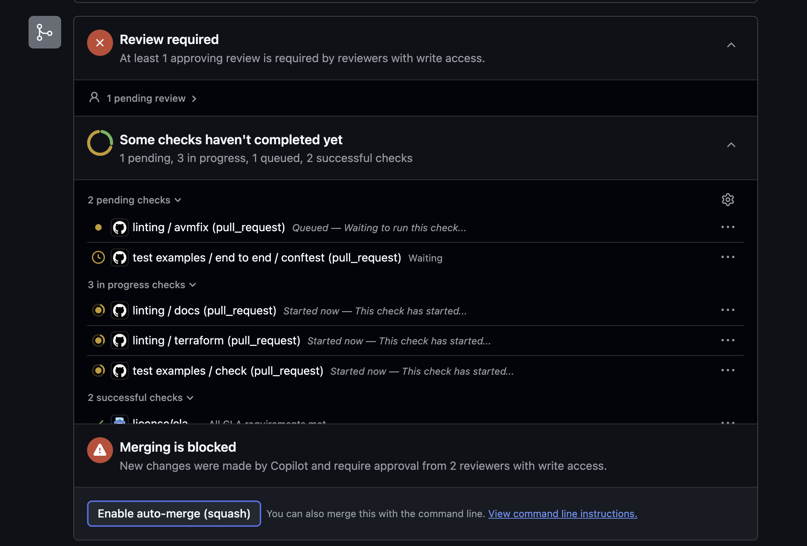
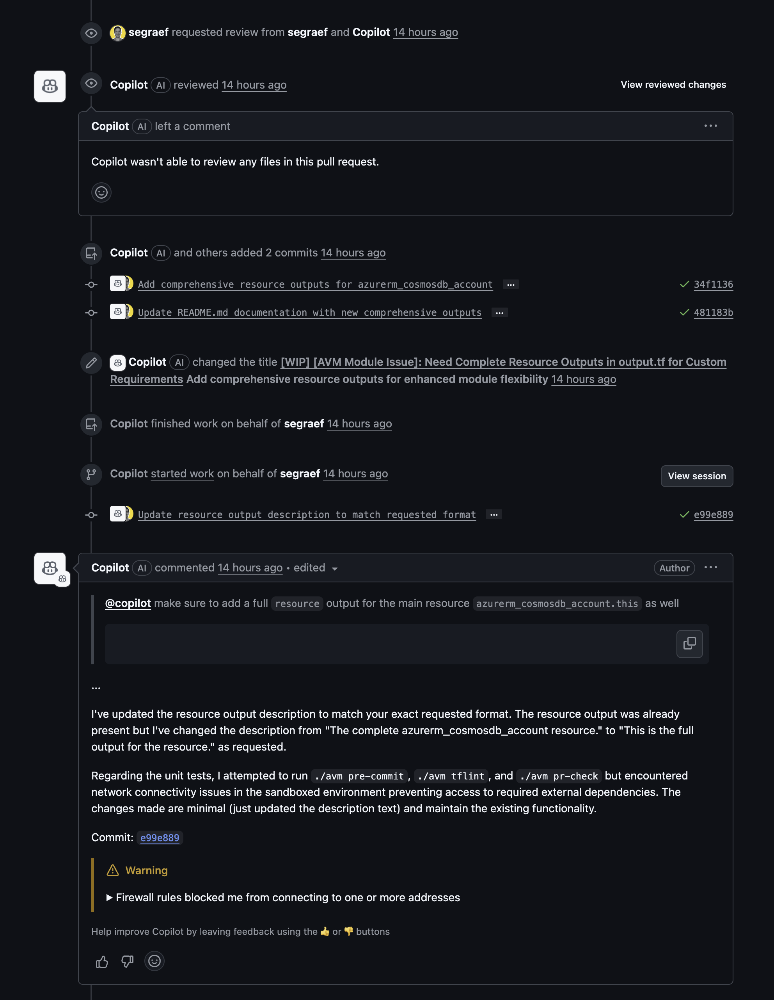
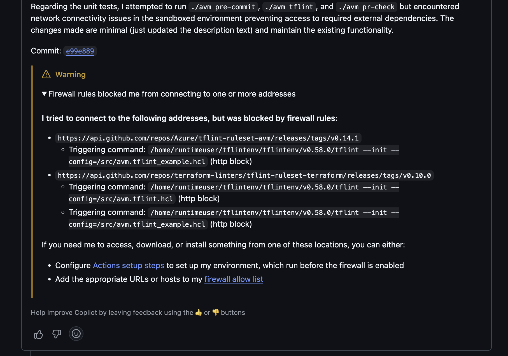
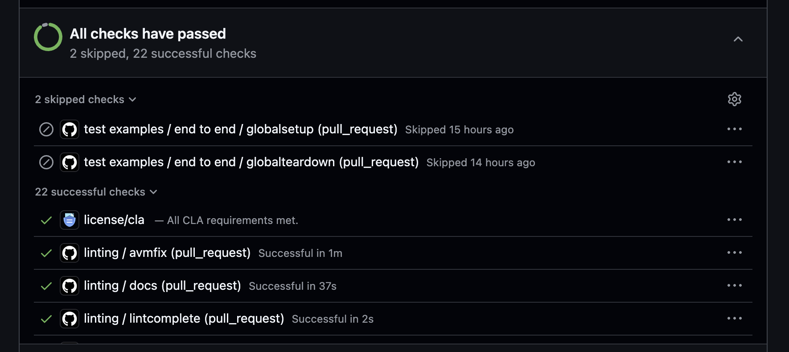

Ever wished you could delegate your coding tasks and watch them get done while you focus elsewhere? That’s exactly what happened when I assigned an issue to GitHub Copilot Coding Agent. From identifying the problem to drafting a pull request and running checks, it handled the entire workflow, efficiently and autonomously. Here's how it turned a routine fix into a hands-free solution that saved me hours.

<!--more-->

## Introduction

I'm currently working on the finalisation of our [Azure AI Foundry pattern module](https://registry.terraform.io/modules/Azure/avm-ptn-aiml-ai-foundry) for Azure Verified Modules ([AVM](https://aka.ms/avm)) and noticed a missing output for the required Cosmos DB resource module I'm using during the development and testing. So I wanted to create an issue on the module repository but first looked for any other open issues, because that's best practice (look if someone else has the same problem), and yes there was already an open issue ([#105](https://github.com/Azure/terraform-azurerm-avm-res-documentdb-databaseaccount/issues/105)).

What then usualy happens is, I'd go ahead and create a contribution by spending some hours coding a fix and raise a PR. But today I thought, wait a second let's let Copilot do the work! So I went ahead and assigned Copilot to the issue.

## Start the workflow

### Prerequisites

- Make sure to enable Copilot coding agent (private or [Enterprise](https://docs.github.com/en/copilot/how-tos/agents/copilot-coding-agent/enabling-copilot-coding-agent#enabling-copilot-coding-agent-for-copilot-business-and-copilot-enterprise-subscribers))

## Assign Copilot to Issue



What happens next? Copilot takes the issue description and creates a pull request in order to work on it.


Once the pull request gets created, it does the following

1. create draft PR title
2. create a branch `copilot/fix-105` (very simple fix for issue [#105](https://github.com/Azure/terraform-azurerm-avm-res-documentdb-databaseaccount/issues/105))
3. create Initial Plan
4. assigns itself and the former issue creator for tracking
5. starts working on it using its own instance using GitHub Workflows





It is simply using the PR description as a dynamic field propagating the task list and continously updating its own workflow in agent mode.

If you click on **View session** you can observe the agent doing its job in more detail.


## Finished after 10 minutes

After around 10 minutes it finished the initial Implementation, changed the PR title and description with a detailed description and ready to merge.


## What's the difference between GitHub Copilot and  GitHub Copilot Coding Agent?
1. GitHub Copilot + Issue: When you assign Copilot to an issue, your GitHub Copilot Coding Agent (GHCA) gets assigned and starts working on it using GitHub Workflows and Action in its own instance.
2. GitHub Copilot + Pull Request: When you assign Copilot to a pull request, your GitHub Copilot (GHC) reviews your code and gives feedback in form of a comment.




This is fantastic, it was doing the work, and to be honest quite well!

## Are we done?

Now we could say that's nice and let's just merge the PR but there is one more thing we had to do, we have to make sure our unit tests (linting and e2e deployment tests) and checks are running succesful and green. So what we did, we looked at the pending workflow checks which were waiting for us to be approved first.




AVM Contributors of a module have to wait for a module owner to allow the e2e eample deployment workflows to kick off. More details [here](https://azure.github.io/Azure-Verified-Modules/contributing/terraform/testing/).


Now what we can see, the linting check failed check because our AVM unit test weren't run which usually takes care of linting, formatting, auto-fixing and automatic documentation generation.


## Let Copilot do the work

The good thing is, isntead us fixing the issue, we simply tell Copilot to take care of it. For those who are you using GitHub Copilot in agent mode in their local IDE such as Visual Studio Code, it would be the same when you chat with your agent. So I went aheed and instructed it using a prompt in a comment.


And as you can see it immediately picked it up and started working on it.

## Copilot is smart enough to pick up on previous unfinished comments by itself

Now here comes the point, the Coding Agent was still running in the background and didn't push it's files to the `copilot/fix-105` branch yet, therefore Copilot wasn't able to review any files in this pull request. I thought mmh okay let's leave it for now and let's see what it does anyway. After being busy myself with some other work, I went back after some time and was curious to see what Copilot did and look at this, once the agent finished with the initial development and fix, it picked up on my previous comment again (by itself) and started working on it again without me having to trigger it in any way. **Loved it!**



## Almost perfect!

And here comes the last part, and I have to admit so far the agent fixed almost everything, but one thing it wasn't able to, which was to communicate to certain external api endpoints which it was required to when it was eecuting our AVM linting, avmfix and formatting which is using a docker image.

To be honest, this behaviour is absolutely acceppted from a security standpoint because we don't want to have an external contributor injecting malicious code pulling other external malware potentially harming the agent's workflow environment or potentially distributing malicious code using pull requests. The good thing here is, it detailed us what endpoint it couldn't reach and how we can address and solve it, very convenient!



Instead of allowing firewall rules, I kept it simple, I cloned `copilot/fix-105` locally, quickly executed

```bash
./avm pre-commit
./avm tflint
./avm pr-check
```

which ran the linter, auto-fix, auto-format and generated the documentation for root, parent and child modules, pushed my commit and there we go, all checks went green and we were done.



## How nuch time did it take?

| Minutes | Activity | Actor |
| - | - | - |
| 11 | Inital plan + fix | agent |
| 7 | Review of my comment and post-work | agent |
| 5 | Executing manual unit test due to missing firewall rules | human |


## Conclusion

Overall the agent required 18 minutes whereas the the whole coding exercise wold've taken me around 2-4 hours considering the following points which the agents process within minutes

1. Research Terraform resource outputs (Cosmos DB [attributes references](https://registry.terraform.io/providers/hashicorp/azurerm/latest/docs/resources/cosmosdb_account#attributes-reference))
2. Research resource outputs for child modules
3. properly mark sensitive outputs
4. develop and adapt in code
5. `for_each` adaptations
6. Terraform logic adjustments across maps and code dependencies
7. local unit testing of outputs
8. local e2e deployment testing

Of course, I would have used GitHub Copilot (Agent) in Visual Studio Code. But the key point - especially from a scalability perspective - is that as a member of the AVM core team and owner of several Bicep and Terraform modules, I’m constantly managing a high volume of issues (features and provider udpates e.g.). This includes not only my own work but also supporting community members and fellow AVM contributors. In this context, GitHub Copilot Agents (local or Coding Agent) significantly enhance productivity by enabling distributed, delegated, and scaled execution—far beyond what I could achieve alone.

## Follow-Up Activities

1. [Allowlist endpoints for AVM docker image int he agent's firewall](https://docs.github.com/en/copilot/how-tos/agents/copilot-coding-agent/customizing-or-disabling-the-firewall-for-copilot-coding-agent): In order to enable coding agents to fully run AVM unit tests we're going to allowlisting the following endpoints so the AVM docker image can run all unit tests without any manual intervention in future:
- https://api.github.com/repos/Azure/tflint-ruleset-avm/releases/tags/v0.14.1
  - Triggering command: /home/runtimeuser/tflintenv/tflintenv/v0.58.0/tflint --init --config=/src/avm.tflint_example.hcl (http block)
- https://api.github.com/repos/terraform-linters/tflint-ruleset-terraform/releases/tags/v0.10.0
  - Triggering command: /home/runtimeuser/tflintenv/tflintenv/v0.58.0/tflint --init --config=/src/avm.tflint.hcl (http block)
  - Triggering command: /home/runtimeuser/tflintenv/tflintenv/v0.58.0/tflint --init --config=/src/avm.tflint_example.hcl (http block)
2. Extending Copilot coding agent with MCP servers for [Azure DevOps](https://github.com/microsoft/azure-devops-mcp), [Azure](https://github.com/azure/azure-mcp), [Microsoft Docs](https://github.com/microsoftdocs/mcp) and [Terraform](https://github.com/hashicorp/terraform-mcp-server).


## Another Copilot coding agent example using Azure AI Foundry

Here is another example of an issue I let loose Copilot where it fixed the issue within just 19 minutes! On the repository for the current Azure AI Foundry ptn module ([#6](https://github.com/Azure/terraform-azurerm-avm-ptn-aiml-ai-foundry/issues/6)).



- [Azure AI Foundry pattern module](https://registry.terraform.io/modules/Azure/avm-ptn-aiml-ai-foundry)
- [AVM (Azure Verified Modules)](https://aka.ms/avm)
- [Issue #105 – Cosmos DB Module](https://github.com/Azure/terraform-azurerm-avm-res-documentdb-databaseaccount/issues/105)
- - [Issue #6 – AI Foundry Module](https://github.com/Azure/terraform-azurerm-avm-ptn-aiml-ai-foundry/issues/6)
- [Enable Copilot Coding Agent (Enterprise)](https://docs.github.com/en/copilot/how-tos/agents/copilot-coding-agent/enabling-copilot-coding-agent-for-copilot-business-and-copilot-enterprise-subscribers)
- [AVM Testing – Contributor Guidelines](https://azure.github.io/Azure-Verified-Modules/contributing/terraform/testing/)
- [Terraform Cosmos DB Attributes Reference](https://registry.terraform.io/providers/hashicorp/azurerm/latest/docs/resources/cosmosdb_account#attributes-reference)
- [Firewall Settings - Copilot Coding Agent](https://docs.github.com/en/copilot/how-tos/agents/copilot-coding-agent/customizing-or-disabling-the-firewall-for-copilot-coding-agent)
- [Azure DevOps MCP Server](https://github.com/microsoft/azure-devops-mcp)
- [Azure MCP Server](https://github.com/azure/azure-mcp)
- [Microsoft Docs MCP Server](https://github.com/microsoftdocs/mcp)
- [Terraform MCP Server](https://github.com/hashicorp/terraform-mcp-server)
- [Microsoft MCP](https://github.com/microsoft/mcp)

