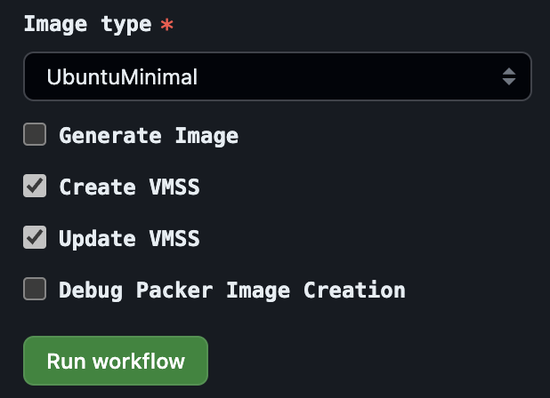
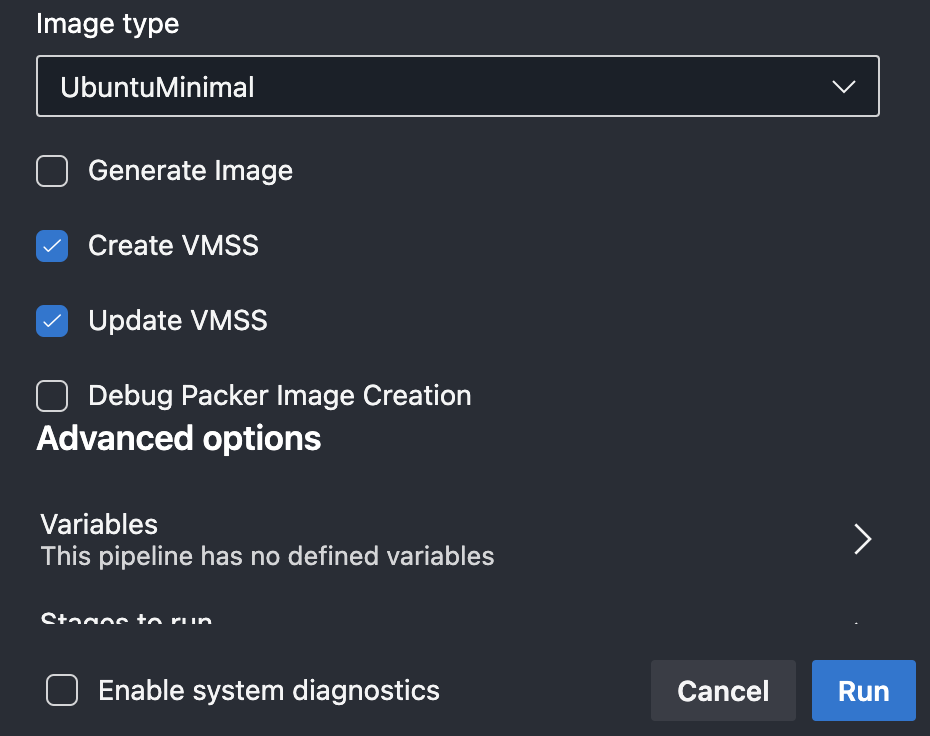

# Create your own official Azure Pipelines Agent Images and GitHub Actions Runner Images


Use this article if you want to create your own Azure Pipelines Agent Images and GitHub Actions Runner Images based on the official [source code](https://github.com/actions/runner-images/) used for [GitHub-hosted runners](https://docs.github.com/en/actions/using-github-hosted-runners/about-github-hosted-runners) used for Actions, as well as for [Microsoft-hosted agents](https://docs.microsoft.com/en-us/azure/devops/pipelines/agents/hosted?view=azure-devops#use-a-microsoft-hosted-agent) used for Azure Pipelines. I prepared both Azure Pipelines and GitHub Workflow examples for you to choose from. It also can create your Virtual Machine Scale Set (VMSS) with the latest VM image to easily use for self-hosted auto-scaling scale-set agents in Azure DevOps.

<!--more-->

## The Problem

Usually when I start working with teams in new cloud environments for a longer period of time, I find the same pattern: infrastructure and application code is first tested on cloud-hosted pipeline/workflow agents/runners (because they are quickly available, low cost and reliable) and then (much too late) switched to self-hosted agents/runners (because they are more secure and isolated). With a security-first mindset, however, development and testing must start directly on self-hosted agents/runners. Not only because of security but also because of isolated network connection such as private endpoints. Likewise, because the subsequent switch from cloud-hosted to self-hosted is usually more difficult and involves downtime.

Another problem is that teams often create their own VM images which are not identical with the official images used for the cloud-hosted agents/runners. This can lead to problems when the application code is tested on the cloud-hosted agents/runners and then deployed to the self-hosted agents/runners. This is because the application code may not work on the self-hosted agents/runners due to differences in the VM images.

## The Solution

The solution is to create your own Azure Pipelines Agent Images and GitHub Actions Runner Images based on the exact same image used for the official [GitHub-hosted runners](https://docs.github.com/en/actions/using-github-hosted-runners/about-github-hosted-runners) and [Microsoft-hosted agents](https://docs.microsoft.com/en-us/azure/devops/pipelines/agents/hosted?view=azure-devops#use-a-microsoft-hosted-agent). This way you can test your infrastructure and application code directly on self-hosted agents/runners from the beginning in a secure and isolated environment. And you can be sure that the application code will work on the cloud-hosted agents/runners as well as on the self-hosted agents/runners. If golden images are used, they could also be compiled using the predefined packerfiles or their tools could be integrated into the golden images.

## Create and/or update the VMSS

The solution not only creates the VM images but also can create or update the Virtual Machine Scale Set (VMSS) with the latest VM image to use for auto-scaling and [self-hosted scale-set agents](https://learn.microsoft.com/en-us/azure/devops/pipelines/agents/scale-set-agents?view=azure-devops). This way you can use the VMSS to create your own self-hosted agents/runners.




> **Note:** The [`Functions.ps1`](/.scripts/Functions.ps1) used can also be executed on your own local machine.

## Create VM Image (Azure Pipeline)

### Pre-requisites
1. Azure Account
2. Azure DevOps Account
   1. Service Connection (Contributor)
3. Optional: GitHub Account
   1. Azure Service Principal (Contributor)

### Prepare the Azure Pipeline to create your image

1. Create a new Azure Pipeline using the `/.pipelines/pipeline.yml` file.
2. Create a service connection to your Azure Subscription.
3. Run the pipeline and choose between the following image types:
   1. `UbuntuMinimal` (default)
   2. `Ubuntu2204`
   3. `Ubuntu2004`
   4. `Windows2019`
   5. `Windows2022`





### Reference Pipeline

You can have a look at this reference pipeline: [](https://dev.azure.com/segraef/apai/_build/latest?definitionId=42)

## Create VM Image (GitHub Workflow)

### Pre-requisites
1. Azure Account
2. GitHub Account
   1. Azure Service Principal (Contributor)

### Prepare the GitHub Workflow to create your image

1. Create a new GitHub Workflow using the `/.github/workflows/workflow.yml` file.
2. [Create a service principal](https://learn.microsoft.com/en-us/azure/developer/github/connect-from-azure?tabs=azure-cli%2Clinux#use-the-azure-login-action-with-a-service-principal-secret) assigned with the Contributor role to your Azure Subscription.
3. Create the GitHub Actions repository secret `AZURE_CREDENTIALS` with the output data from the previously created service principal. Which looks like this:
    ```json
    {
        "clientId": "<clientId>",
        "clientSecret": "<clientSecret>",
        "subscriptionId": "<subscriptionId>",
        "tenantId": "<subscriptionId>",
        "activeDirectoryEndpointUrl": "https://login.microsoftonline.com",
        "resourceManagerEndpointUrl": "https://management.azure.com/",
        "activeDirectoryGraphResourceId": "https://graph.windows.net/",
        "sqlManagementEndpointUrl": "https://management.core.windows.net:8443/",
        "galleryEndpointUrl": "https://gallery.azure.com/",
        "managementEndpointUrl": "https://management.core.windows.net/"
    }
    ```
4. Run the GitHub Runner Image workflow and choose between the following image types:
   1. `UbuntuMinimal` (default)
   2. `Ubuntu2204`
   3. `Ubuntu2004`
   4. `Windows2019`
   5. `Windows2022`





### Reference Workflow

You can have a look at this reference workflow: [](<https://github.com/segraef/apai/actions/workflows/workflow.yml>)

## Create self-hosted scale-set agents

If you let your VMSS created by the pipeline/workflow, you can use it to create your own self-hosted scale-set agents in Azure DevOps.





- [Create a service principal](https://learn.microsoft.com/en-us/azure/developer/github/connect-from-azure?tabs=azure-cli%2Clinux#use-the-azure-login-action-with-a-service-principal-secret)
- [GitHub-hosted runners](https://docs.github.com/en/actions/using-github-hosted-runners/about-github-hosted-runners)
- [Microsoft-hosted agents](https://docs.microsoft.com/en-us/azure/devops/pipelines/agents/hosted?view=azure-devops#use-a-microsoft-hosted-agent)


