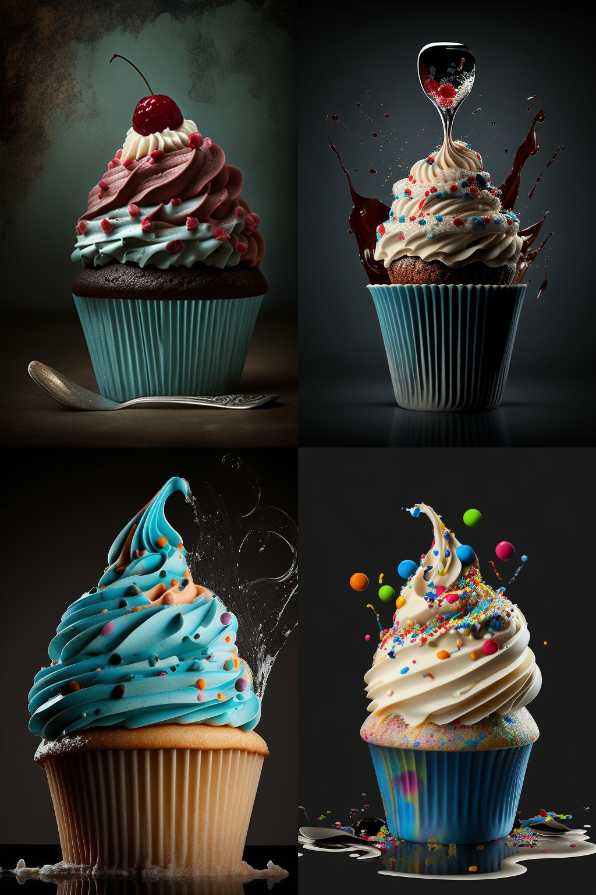
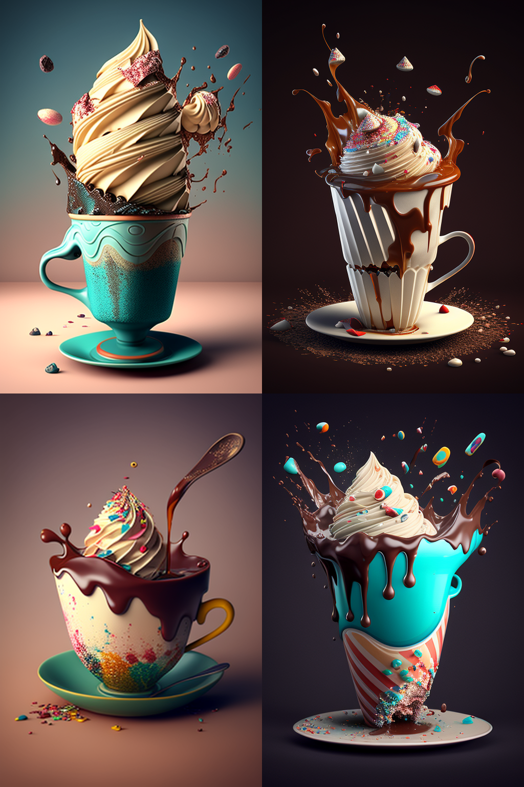
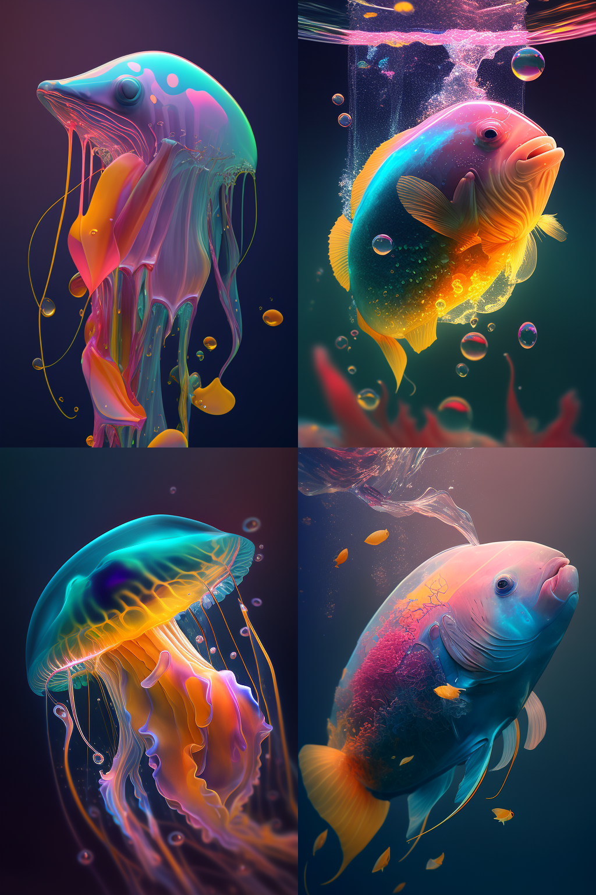
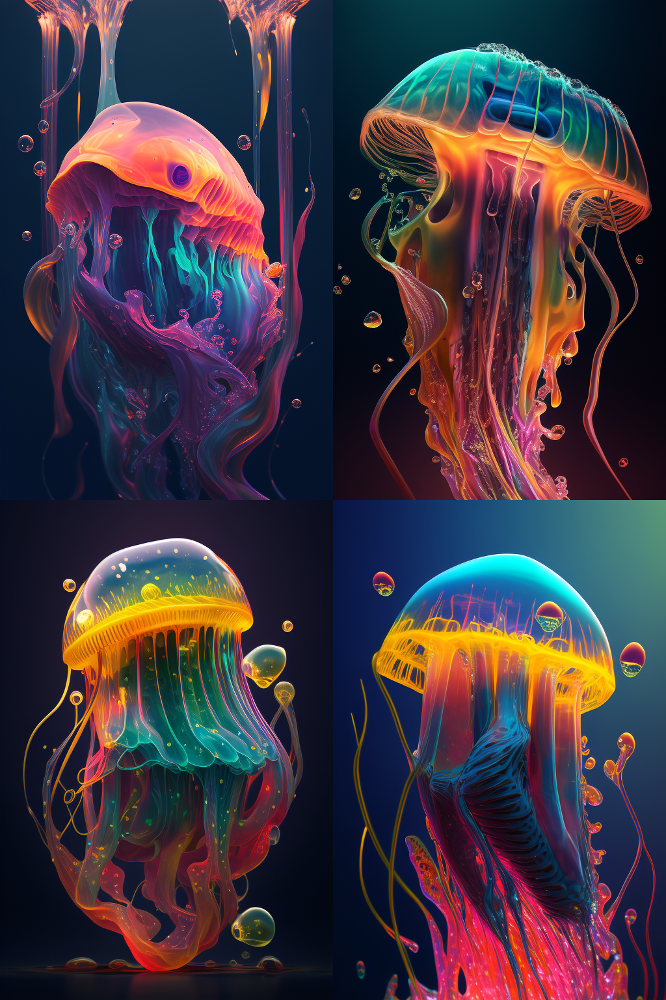
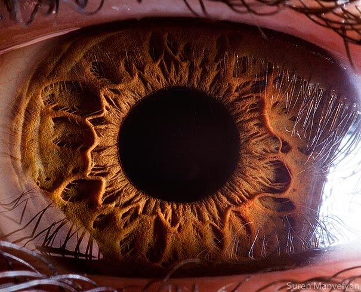
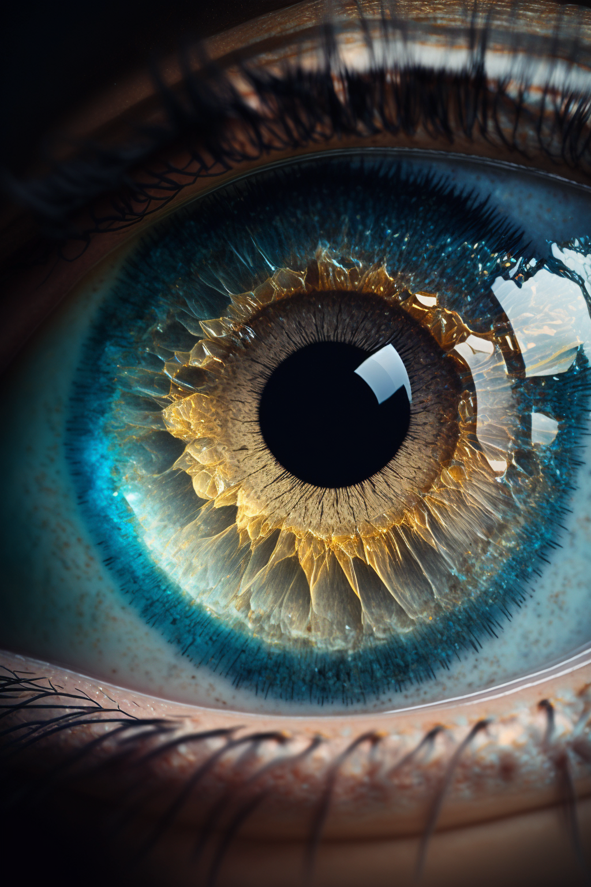

# From Code to Canvas: A Guide for Prompting Stunning AI Art with MidJourney (1/2)

Unlock your artistic potential and create jaw-dropping AI art with these exclusive cheat codes for Midjourney. These expert hacks will take your art to new heights, no coding skills required!

<!--more-->

## Introduction

Artificial intelligence (AI) is revolutionizing many industries, including the world of art. I have seen firsthand the incredible potential of artificial intelligence to create stunning and original pieces of art. From computer-generated paintings to AI-generated music, the possibilities are endless. That's why I want to prompt you to explore the world of AI art and create something truly jaw-dropping.



In this blog post, I'll provide you with sweet and exclusive prompts to get started with creating jaw-dropping AI art. Let's dive in and see how you can use your skills and knowledge to create something truly amazing!

## Prerequisites

You should already have an account with [www.midjourney.com](https://midjourney.com) and be familiar with how to use `/imagine` prompts.

## Prompt Commands

Let's just get straight to the point, we all know the **Basic ommands**:

- `/imagine` creates an image based on the prompt text you provided. It produces a grid of 4 images, taking around 50 seconds with default settings.
- `/settings` gives you an interactive window to select options.
- `/help` displays universally helpful information and tips about the Midjourney bot.
- `/info` shows information about your profile, plan, usage, and currently running jobs.
- `/subscribe` creates a unique link to the subscription page of your current Discord account, without needing to sign in on the website.

but more important are `/imagine` parameters:

- `--aspect` or `--ar` changes the aspect ratio of a generation (default: `--ar 1:1`)
- `--no` Negative prompting, `--no mushrooms` would try to remove mushrooms from the image.
- `--stylize` or `--s` parameter influences how strongly Midjourney's default aesthetic style is applied to Jobs.
- `--quality <.25, .5, 1, or 2>`, or `--q <.25, .5, 1, or 2>` defines how much rendering quality time you want to spend (default: `1`)
- `--seed <integer between 0–4294967295>` When using the MidJourney bot to create AI-generated art, the process begins by generating a field of visual noise, similar to television static, using a seed number. This seed number is randomly generated for each image, but can also be specified using the `--seed` or `--sameseed` parameter. By using the same seed number and prompt for multiple images, you can achieve similar ending images with subtle variations, allowing you to experiment and fine-tune your artistic vision.

More parameters see [Parameters List](https://docs.midjourney.com/docs/parameter-list).

### Multi-Prompts and Prompt Weighting

To employ multi-prompts in Midjourney, insert a double colon (`::`) in between your prompts without any gaps. Multi-prompts are typically employed to modify the behavior of compound words in the prompts.

|cup cake|cup:: cake|
|---|---|
|||
| *Cup cake* is considered as a single word. | *Cup* and *cake* are considered separate words. |

The double colon `::` is used to divide a prompt into parts. You can put a number after it to show how important that part is. Adding a number to a word is called prompt weighting or text weighting.

|jelly:: fish|jelly::2 fish|
|---|---|
|     |     |
| *Jelly* and *fish* are considered separate words. | *Jelly* is twice as important as *cake*.|

More details see [Multi Prompts](https://docs.midjourney.com/docs/multi-prompts)

### Prefer Suffix

Since you know me and everything I do is about to ***Automate everything*** you can and should use a *Suffix*:

- `/prefer` command saves you having to type the options every time that you use the `/imagine` command

I'm usually working with the prefix `/prefer suffix --ar 2:3 --q 2` which always sets my aspect ratio to portrait and uses best quality.




## Aspect Ratios
### 1:1 (Square)


### 2:3 (Portrait)


### 3:2 (Landscape)


### 16:9 (Wallpaper)


### 1:2


### 2:1


## Cheat Codes
Okay, enough basics, let's get to the gist and give you some good examples!

> ***Note:*** In some prompts I used multi-prompts as well as weighting to achieve better results.

### "as *this* or *that*"
Let's say you want to have your character/style look like something you have in mind (Disney, Pixar, Superman, ...), just use "`... as Superman`" or "`... as Disney`", or even both.



### Glitchart


### Nebula vs. Psychedelic



### Double Exposure


### 32 Bit Isometric


### Old Photograph


### Neon


### Oil Painting


### Cyberpunk


### Retrowave


### Retro



### Blueprint Drawing



### Pixelart



### Synthwave


### Retro-Futurism


### LSD


### Ukiyo-e Art


### Duotone


### Diagramatic Drwaing


### Phantasmal Iridescent


### Luminescent


### Fluorescence



### Carnival Glass

### Artists

> ***Note:*** Aspect ratio was set to 3:2 (Landscape).
>









### Generate new images based on your own images
`/imagine https://link-to-your-image.jpg <your prompt>`

| Base Image | Generated Image |
|---|---|
|       |     |
| Credits: [Suren Manvelyan](https://www.behance.net/paronsuren) | Prompt: `http://graef.io/from-code-to-canvas-a-guide-for-prompting-stunning-ai-art-with-midjourney/20230306165037.png:: Celestial mist superimposed over human eye::5 close up view of eye only ::5` |

## Midjourney Prompt Helper


Check out the next part
- [From Code to Canvas: A Guide for Prompting Stunning AI Art with MidJourney (2/2))](../from-code-to-canvas-a-guide-for-prompting-stunning-ai-art-with-midjourney-2/)



- [Midjourney Parameters List](https://docs.midjourney.com/docs/parameter-list)
- [MidJourney Prompt Helper](https://prompt.noonshot.com/)
- [Multi Prompts](https://docs.midjourney.com/docs/multi-prompts)


