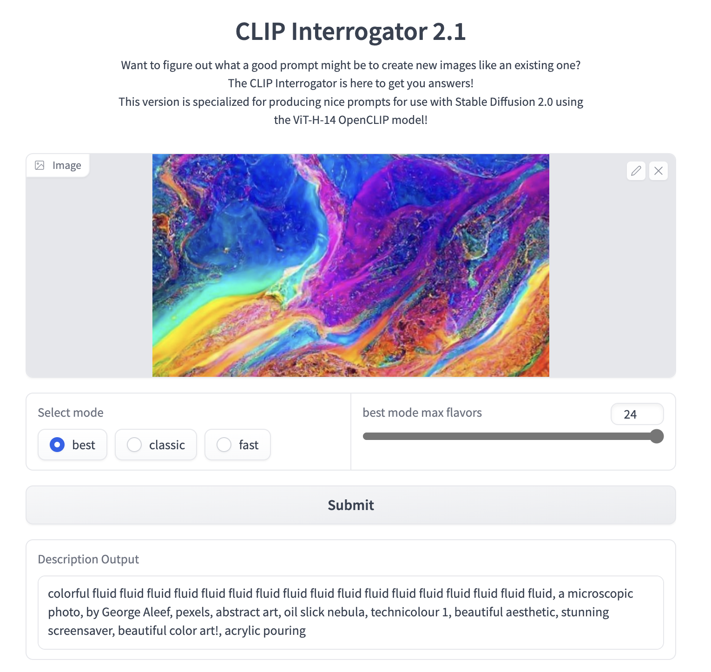

# From Code to Canvas: A Guide for Prompting Stunning AI Art with MidJourney (2/3)

Welcome to the second part of guided prompting for Midjourney to unlock your artistic potential and create jaw-dropping AI art with exclusive cheat codes. These expert hacks will take your art to new heights, no coding skills required!

<!--more-->

## Prerequisites


Make sure to check out the first part
- [From Code to Canvas: A Guide for Prompting Stunning AI Art with MidJourney (1/3)](../from-code-to-canvas-a-guide-for-prompting-stunning-ai-art-with-midjourney-1/)


## Cheat Codes
Here are more good example prompts!

> ***Note:*** In some prompts I used multi-prompts as well as weighting to achieve better results.

### 32 Bit Isometric


### Old Photograph


### Neon


### Oil Painting


### Cyberpunk


### Retrowave


### Retro



### Blueprint Drawing



### Pixelart



### Synthwave


### Retro-Futurism


### LSD


### Ukiyo-e Art


### Duotone


### Diagramatic Drwaing


### Phantasmal Iridescent


### Luminescent


### Fluorescence



### Carnival Glass


### Abstract



### Artists

> ***Note:*** Aspect ratio was set to 3:2 (Landscape).










## Keyword Cheat Sheet

These keywords are good to control and finetune

| Keyword | Description |
|---|---|
|`Fine ultra-detailed realistic`|may have some graininess and roughness, but it enhances the level of detail.|
|`Ultra photorealistic`|is similar to `fine ultra-detailed realistic` in terms of its level of realism.|
|`Hasselblad H6D`|produces a sharper focus on the subject, but it deepens shadows.|
|`High definition`|lighting tends to be brighter and more colorful, with increased saturation.|
|`8k`|technology often produces even more saturated and computer-generated colors than `high definition,` with extreme lighting effects.|
|`Cinematic`|lighting features more dramatic shadows and slightly thicker objects, giving a poster-like appearance.|
|`Color grading`|involves extreme variations in hue and vibrant but not overly saturated colors.|
|`Depth of field`|creates a sharp focus on the subject while blurring the foreground and background.|
|`Film lighting`|features limited light sources, common backlighting, and deep shadows cast by light sources.|
|`Rim lighting`|produces slightly stronger lighting effects than `film lighting,` but with very similar results.|
|`Volumetric lighting`| |
|`Softbox lighting`| |
|`Long exposure`| |
|`Fairy Lights`| |
|`Intricate details`|designs tend to feature non-realistic `crafts` and `pattern` elements.|
|`Realism`|tends to focus on artistic realism, with more uniform backgrounds and subject matter that looks like a painting.|
|`Photography`|typically includes a small area of objects surrounding the subject, with little else in the background.|
|`Rendered for IMAX`|involves more complex subjects with highly directional lighting and subdued saturation.|
|`Tilt-shift`|creates a similar effect to `depth of field,` but from a high angle or from above.|
|`Motion-blur`|adds speed lines to the image, creating the impression of motion or wind.|
|`35mm film`|produces vibrant colors but muted saturation, with additional foreground and/or background elements for added detail.|
|`Soft focus`|creates a slightly blurry focus with a thinner subject and potentially grainy details, with colors tending towards pastels.|
|`Harsh lighting`|creates extreme contrast with deep shadows.|
|`Minimalist line art`|features a simplified pen-on-paper type line sketch of the subject with few or no additional elements.|
|`Hasselblad full frame`|produces a similar effect to `35mm film,` with a stronger emphasis on contrast.|
|`Sony Alpha α7, ISO1900, Leica M`|to specify any lens type or camera type|
|`Unreal`|to specify an unreal engine feel|

`glass vases on top of a table, microscopic photo, inspired by Brunce Munro, intricate, ultra-detailed, 8k, LSD, symmetric, refracted sparkles, ray tracing`

## ChatGPT + Midjourney and Prompt Generators

Just let ChatGPT do the job and generate Midjourney prompts for you:




Here are the formulas:

  - Formula 1: `image to prompt:: 5 descriptive keywords:: camera type:: camera lens type:: time of day:: style of photograph:: type of film`
  - Formula 2: `image to prompt:: 5 descriptive keywords:: type of photography:: lens:: distance:: subject:: direction:: type of film`

Another really helpful tool is the [MidJourney Prompt Helper](https://prompt.noonshot.com/) which gives you amazing good style approaches.

## Image2Prompt

Want to know what a prompt sits behind a generated image? The [CLIP Interrogator 2.1](https://huggingface.co/spaces/fffiloni/CLIP-Interrogator-2) is your friend!


Check out the next part
- [From Code to Canvas: A Guide for Prompting Stunning AI Art with MidJourney (3/3)](../from-code-to-canvas-a-guide-for-prompting-stunning-ai-art-with-midjourney-3/)



- [Midjourney Parameters List](https://docs.midjourney.com/docs/parameter-list)
- [MidJourney Prompt Helper](https://prompt.noonshot.com/)
- [Multi Prompts](https://docs.midjourney.com/docs/multi-prompts)
- [Understand Camera Lenses](https://www.masterclass.com/articles/basic-photography-101-understanding-camera-lenses)
- [Types of Photography](https://photographylife.com/types-of-photography)


