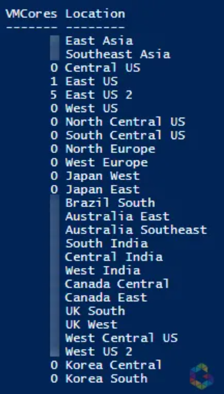

# Get Azure VM Cores (vCPUs) per Region


If you need a script which outputs you the overall VMCore amount per region, there you go.
This is a snippet from a RunBook which iterates also through each subscription before, so you would get all amount of used cores per subscription as well as per region.

I took the advantage of using Get-AzVMUsage.

```powershell
$AzureLocations = Get-AzLocation | Select-Object DisplayName
$Result = @()
ForEach ($AzureLocation in $AzureLocations) {
    $CoreAmount = Get-AzVMUsage -Location $AzureLocation.DisplayName | Where-Object { $_.Name.Value -eq "virtualMachines" } | Select-Object currentvalue
    $Object = New-Object -Type PSCustomObject -Property @{
        Location = $AzureLocation.Displayname
        VMCores  = $CoreAmount.CurrentValue
    }
    $Object
    $Result += $Object
}
$Result
```



