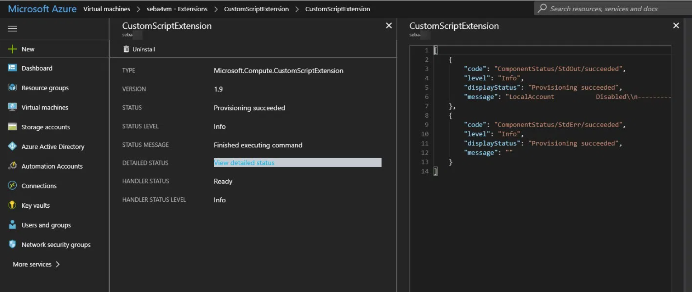

# Get Local Account Memberships


Okay, yeah there are plenty of scripts out which give you local accounts via WMI or ADSI and yes scripts exist also which give you all local groups but there is not one which gives you both (of course there are also some) but what if you’re looking to implement this as a CustomScriptExtension to your Azure VM? Especially if the Custom Script Extension Output is limited to only 4096 characters? Did you know that? This script was developed to minimize the output of local accounts and their group memberships and gives you a meaningful expression of user accounts sitting on your VM. Check this out:

```powershell
Function Get-LocalAccountMemberships {
    <#
    .SYNOPSIS
    Retrieves local user accounts and their group memberships.

    .DESCRIPTION
    Retrieves local user accounts and their group memberships. For having the Output prepared for a
    Custon Script Extension in Azure Export-Clixml is being used which can then be deserialized with
    Import-Clixml.

    .PARAMETER ComputerName
    A single Computer or an array of computer names. The default is localhost ($env:COMPUTERNAME).

    .PARAMETER GroupName
    A single stirng or array of Groups to be verified.

    .EXAMPLE
    PS Get-LocalAccountMemberships -GroupName Users,Administrators

    .NOTES
    Author: Sebastian Gräf
    Email: ps@graef.io
    Date: December 15, 2017
    PSVer: 3.0/4.0/5.0
    #>

    param(
        [parameter(ValueFromPipeline = $true, ValueFromPipelineByPropertyName = $true)]
        [array]$ComputerName = $Env:COMPUTERNAME,
        [array]$GroupName
    )

    $results = @()
    $arr = @()
    $LocalAccounts = Get-WmiObject -ComputerName $ComputerName -Class Win32_UserAccount -Filter "LocalAccount='$True'"
    foreach ($LocalAccount in $LocalAccounts) {
        $obj = New-Object PSObject
        $obj | Add-Member NoteProperty "LocalAccount" $LocalAccount.Caption
        $obj | Add-Member NoteProperty "Disabled" $LocalAccount.Disabled
        foreach ($Group in $GroupName) {
            $wmi = Get-WmiObject -ComputerName $ComputerName -Query "SELECT * FROM Win32_GroupUser WHERE GroupComponent=`"Win32_Group.Domain='$ComputerName',Name='$Group'`""
            foreach ($item in $wmi) {
                $data = $item.PartComponent -split "\,"
                $domain = ($data[0] -split "=")[1]
                $name = ($data[1] -split "=")[1]
                $arr += ("$domain\$name").Replace("""", "")
            }
            if ($arr -contains $LocalAccount.Caption) {
                $obj | Add-Member NoteProperty "$Group" "true"
            }
            else {
                $obj | Add-Member NoteProperty "$Group" "false"
            }
        }
        $results += $obj
    }
    $results
}

$output = Get-LocalAccountMemberships -GroupName Users, Administrators, 'Remote Desktop Users' | Export-Clixml output.xml
gc output.xml
```

A simple output of Get-LocalAccountMemberships looks like this


So, while exporting your output with the help of Export-Clixml and showing the output of your XML file again in the console output as a readable xml structure.


Once a script was being run on a VM the common output of the Custom Script Extensions looks like this:




You can grab this output of your CustomScriptExtension on your VM with the help of that:

```powershell
$output = Get-AzureRmVMDiagnosticsExtension -ResourceGroupName $ResourceGroupName -VMName $vmName -Name "Get-LocalAccountMemberships" -Status
$output = $output.SubStatuses[0].Message
$output -replace '\\n','' | Out-File output.xml -Force
$output = Import-Clixml output.xml
```

The trick here is to get the output message from your CustomScriptExtension with `$output.SubStatuses[0].Message`, removing every `\n`, save it and import it as a readable xml structure.

Once digested and imported with Import-Clixml you get the same output as before.


So why are we doing it this way?

Consider that, you’re going to execute a Custom Script Extension on your VM without having remote access to it, yes you don’t have access to it BUT you know you can use the Azure VMAgent which is by default installed on every VM in Azure. With having a Custom Script Extension executed including any of your script, e.g. “Get-LocalAccountMemberships” you can grab details from your machine without accessing it at all.


