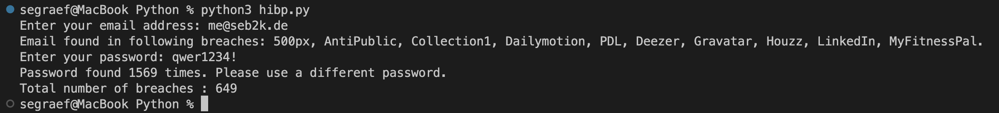

# How to Create Your Own Have I Been Pwned (HIBP) API Request With Python


The idea is to create my own Python script performing REST API requests to the HIBP API to check if mail accounts or password show up in one of the latest breaches. And yes I was just bored and wanted to learn how to do API calls in Python.

<!--more-->

This post is about how to implement and use a Python script to check for breaches in your email addresses and passwords using the HIBP API (Have I Been Pwned). The HIBP API is a free service that allows you to check if your personal information has been compromised in a data breach.

Before you begin, you will need to have the following:

- A HIBP API key, which can be obtained from the HIBP website (https://haveibeenpwned.com/API/Key)
- Python 3 installed on your machine
- The `requests` library, which can be installed by running `pip install requests` in your terminal

To implement the script, you will need to:

1. Import the os, json and requests libraries at the top of your script.
2. Get the API key from the environment variable.
3. Set the endpoint and headers for the API request.
4. Send a GET request to the API endpoint, passing the API key in the headers.
5. Check the status code of the response.

## Check if your email address was found in a breach

```python
import os, json, hashlib, requests
from dotenv import load_dotenv

# Load the environment variables from .env
load_dotenv()

# Get the API key from the environment variables
API_KEY = os.getenv('HIBP_API_KEY')

api_url = 'https://haveibeenpwned.com/api/v3'

# Get the email address from the user input
email = input("Enter your email address: ")

# Use the API key in the headers
headers = {'hibp-api-key': API_KEY}

# Send the GET request to the HIBP API
response = requests.get(f'{api_url}/breachedaccount/{email}', headers=headers)

# Check the status code of the response
if response.status_code == 404:
    print("Email not found in data breaches")
elif response.status_code != 200:
    print("Error checking email")
else:
    # Extract the name of the breaches from the response
    breaches = [breach['Name'] for breach in response.json()]
    print(f"Email found in following breaches: {', '.join(breaches)}.")
```

## Check if your password was found in a breach

```python
import os, json, hashlib, requests
from dotenv import load_dotenv

# Load the environment variables from .env
load_dotenv()

# Get the API key from the environment variables
API_KEY = os.getenv('HIBP_API_KEY')

pwd_api_url = 'https://api.pwnedpasswords.com/range'
# Hash the password before sending it to the HIBP API
password = input("Enter your password: ")
hashed_password = hashlib.sha1(password.encode('utf-8')).hexdigest().upper()
prefix = hashed_password[:5]
suffix = hashed_password[5:]

# Send the GET request to the HIBP API
response = requests.get(f'{pwd_api_url}/{prefix}', headers=headers)

# Check the status code of the response
if response.status_code != 200:
    print("Error checking password")
else:
    # Check if the hashed password suffix exists in the response
    for line in response.text.splitlines():
        line_suffix, count = line.split(':')
        if line_suffix == suffix:
            print(f"Password found {count} times. Please use a different password.")
            break
    else:
        print(f"Password not found. You can use this password.")
```

The output of the script looks like this:




- [Have I been Pwned (HIBP)](https://haveibeenpwned.com/)
- [Understanding and Improving Your Cybersecurity Posture in 2023: The Importance of strong Passwords, 2FA and Awareness of Phishing Scams](https://www.graef.io/understanding-and-improving-your-cybersecurity-posture-the-importance-of-strong-passwords-2fa-and-awareness-of-phishing-scams/)
- [How to REST the Have I Been Pwned (HIBP) API](https://www.graef.io/how-to-rest-have-i-been-pwned-hibp-api/)


