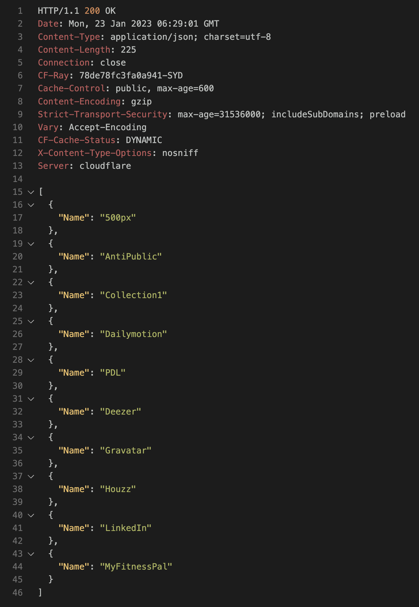
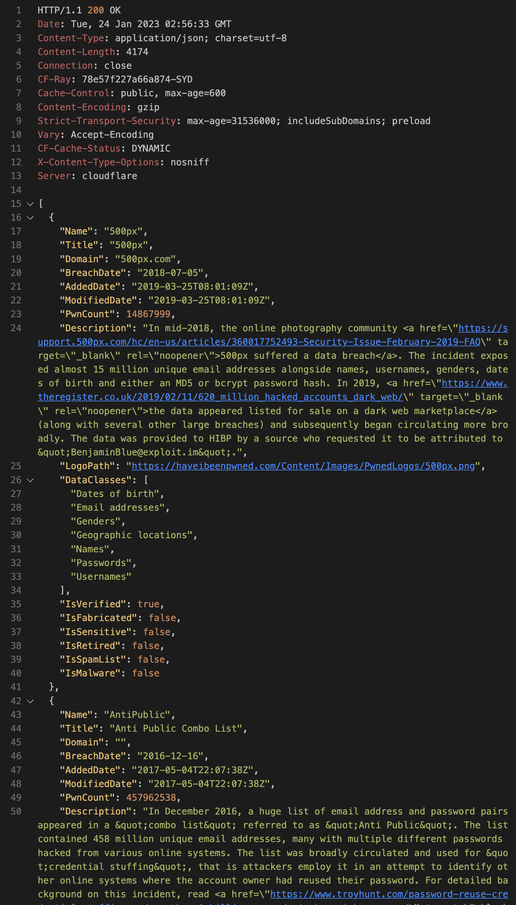

# How to REST the Have I Been Pwned (HIBP) API


Perform REST API requests to the [HIBP API](https://haveibeenpwned.com/API/v3) to verify if your email or password have been involved in a data breach.

<!--more-->

## Prerequisites

- [REST Client](https://marketplace.visualstudio.com/items?itemName=humao.rest-client) (VSCode) or [Postman](https://www.postman.com/downloads/)
- [HIBP API Key](https://haveibeenpwned.com/API/v3)

I prefer integrated extensions like [REST Client](https://marketplace.visualstudio.com/items?itemName=humao.rest-client) within my developer workspace to not have to switch between applications -  Yeah I'm lazy, so what.

A working version for REST calls for email, passwords and breaches can be found at [segraef/Scripts/REST](https://github.com/segraef/Scripts/tree/main/REST) or my [tiny HIBP web app](https://hibq.azurewebsites.net) I wrote using Python and Flask but let me give you the single snippet here to give you the idea:

```
@account = your@email.com
@key = '' # Yes you have to put your API key here
@api = https://haveibeenpwned.com/api/v3

# Get all breaches for an account
GET {{api}}/breachedaccount/{{account}}

# API Key
hibp-api-key: {{key}}
```

The output looks like this:



A more detailed and non-truncated response with breach details looks like this:

```
GET {{api}}/breachedaccount/{{account}}?truncateResponse=false
```




- [Have I been Pwned?](https://haveibeenpwned.com/)


