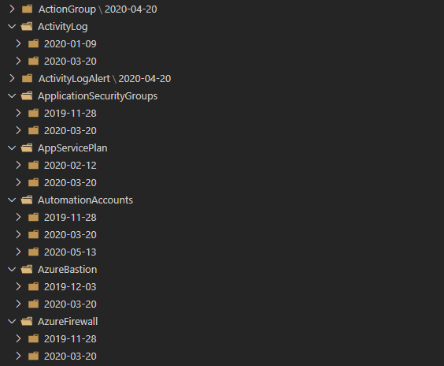
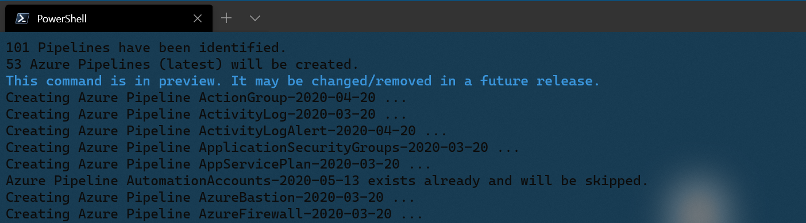
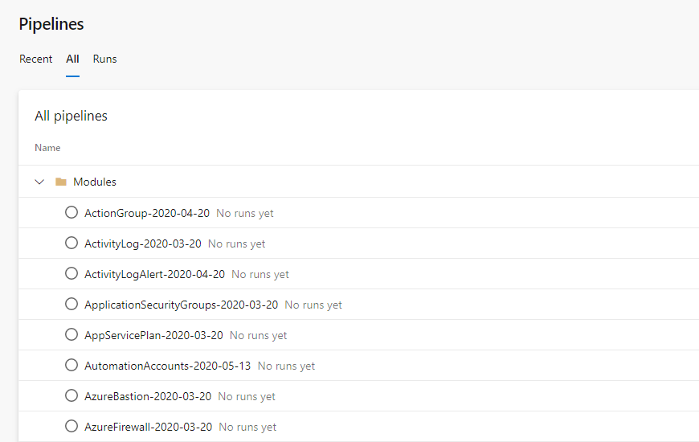

# Programmatically Create Azure Pipelines


This script [New-AzPipeline](https://github.com/segraef/New-AzPipeline) lets you programmatically create Azure Pipelines based on your folder structure.
It browses through your folder structure for pipeline.yml files and creates corresponding Azure Pipelines in Azure DevOps.
It has several features like creating pipelines based on a specific folder/module version, latest version or just creates all.
It also compares against existing Pipelines and skips these.

<!--more-->

## Script

The script New-AzPipeline.ps1 can be found [here](https://github.com/segraef/New-AzPipeline).

> A newer version is in progress already and will be available soon. Check out our [Scripts](https://github.com/segraef/Scripts) repository for any future updates.

## Parameters

**Mandatory**
- OrganizationName (Azure DevOps Organization)
- ProjectName (Azure DevOps Project)
- RepositoryName (Azure DevOps Repository)

**Optional**
- FolderPath (Azure Pipelines folder path)
- Version (Pipeline versions to be used)
- PipelinePath (Local folder path to be browsed)
- Latest (Latest Pipeline versions to be created)
- All (All Pipeline versions to be created)

## Usage

`.\New-AzPipeline.ps1 -OrganizationName <OrganizationName> -ProjectName <ProjectName> -RepositoryName <RepositoryName> -Latest`

## Requirements

- Azure DevOps Login (az devops login) or Azure Login (az login / Connect-AzAccount)
- Azure DevOps Organization
- Azure DevOps Project
- Azure DevOps Repository

## Permissions

Contributor (Azure DevOps)

## Base Folder Structure

```markdown
root
 ┣ Module0
 ┃ ┗ 2020-04-20
 ┃ ┃ ┗ Pipeline
 ┃ ┃   ┣ pipeline.variables.yml
 ┃ ┃   ┗ pipeline.yml
 ┣ Module1
 ┃ ┣ 2020-01-09
 ┃ ┃ ┗ Pipeline
 ┃ ┃   ┣ pipeline.variables.yml
 ┃ ┃   ┗ pipeline.yml
 ┃ ┗ 2020-03-20
 ┃ ┃ ┗ Pipeline
 ┃ ┃   ┣ pipeline.variables.yml
 ┃ ┃   ┗ pipeline.yml
 ┃ .
 ┃ .
 ┗ New-AzPipeline.ps1
 ```

Based on this structure `New-AzPipeline.ps1` recognizes

- `Module0` and `Module1` as Pipeline names
- `2020-04-20` as corresponding versions
- Azure Pipelines based on `pipeline.yml`

## Impressions






## Contributions

 Thanks to [@simonbms](https://github.com/simonbms) for helping me out with the object comparions in order to have only the latest folders picked for the `-Latest` switch.


<!---
:(far fa-bookmark fa-fw): Bookmark this page for easy future reference!
--->
- [Scripts Repository](https://example.com)
- [New-AzPileline.ps1](https://github.com/segraef/New-AzPipeline)


