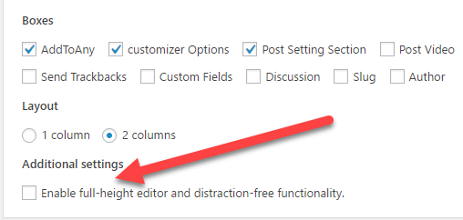

# Wordpress Editor Jump Fix

I’m not quite sure why WordPress does this but it seems to happen after some major upgrades or if one of your themes is not aligned correctly. The editor is jumping up and down while writing posts and this drives me insane! It seems not to happen everytime but mostly after a wordpress update happened or changing something on the interface.
Nevertheless if oyu want ot have it disbaled easily go to Screen Options at the upper right corner of your screen and toggle it.

Under Addition Settings you can see a field called Enable full-height editor and distraction-free functionality.

Untick it and be happy!

